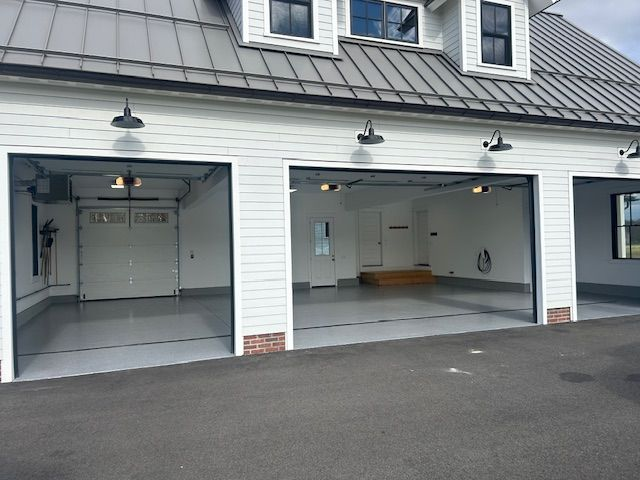

# Commonwealth Concrete Coatings Website

A professional, responsive website for a concrete coating company serving Western Massachusetts.

## Project Structure

```
.
├── index.html          # Main HTML file (complete website)
├── package.json        # Project metadata and scripts
├── README.md          # This file
└── assets/            # (Optional) For storing local images
    └── images/
```

## Features

- **Responsive Design**: Mobile-first approach using Tailwind CSS
- **Smooth Navigation**: Sticky header with active link highlighting
- **Mobile Menu**: Hamburger menu for mobile devices
- **Interactive FAQ**: Accordion-style FAQ section
- **Gallery**: Before/after project showcase
- **Contact Form**: Lead capture form
- **SEO Optimized**: Proper meta tags and semantic HTML

## Technologies Used

- **HTML5**: Semantic markup
- **Tailwind CSS**: Utility-first CSS framework (via CDN)
- **Google Fonts**: Inter font family (via CDN)
- **Vanilla JavaScript**: No frameworks required
- **Placeholder Images**: placehold.co service

## Getting Started

### Option 1: Quick Start (Recommended)

```bash
npm start
```

This will:
1. Start a local HTTP server on port 8000
2. Automatically open the website in your default browser

### Option 2: Manual Server

```bash
npm run serve
```

Then open your browser and navigate to: `http://localhost:8000`

### Option 3: Direct File Access

Simply open `index.html` directly in your browser:
- Windows: Double-click `index.html`
- Mac: Right-click → Open With → Browser
- Linux: Double-click or use `xdg-open index.html`

## Customization Guide

### Update Company Information

Edit these sections in `index.html`:

1. **Phone Number** (Line 419):
   ```html
   <a href="tel:4136688126">(413) 668-8126</a>
   ```

2. **Email** (Line 420):
   ```html
   <a href="mailto:contact@concretecoatingspecialists.com">contact@concretecoatingspecialists.com</a>
   ```

3. **Service Area** (Line 424):
   ```html
   <p class="text-lg">Proudly serving Springfield, Holyoke, Northampton, Palmer and all of Western Massachusetts.</p>
   ```

### Replace Placeholder Images

All images currently use `placehold.co`. To use real images:

1. Create an `assets/images/` folder
2. Add your images there
3. Replace image URLs in the HTML:

**Before:**
```html

```

**After:**
```html

```

### Customize Colors

The site uses Tailwind's blue color scheme. To change:

1. Find all instances of `blue-500`, `blue-600`, etc.
2. Replace with your preferred Tailwind color (e.g., `indigo-500`, `purple-500`)

### Add Form Submission

Currently, the contact form doesn't submit. To enable submissions:

**Option A: Email Service (Recommended)**
Use a service like Formspree, Netlify Forms, or EmailJS

**Option B: Backend API**
Create a backend endpoint and update the form's `action` attribute

## Browser Support

- Chrome/Edge: ✅ Full support
- Firefox: ✅ Full support
- Safari: ✅ Full support
- IE 11: ⚠️ Limited support (Tailwind CSS may not work)

## Performance

- **Page Load**: < 2 seconds (with CDN resources)
- **Lighthouse Score**: 90+ (with real images)
- **Mobile Friendly**: Yes
- **SEO Ready**: Yes

## Deployment Options

### Netlify (Recommended - Free)
1. Push to GitHub
2. Connect to Netlify
3. Auto-deploys on push

### Vercel
1. Push to GitHub
2. Import project to Vercel
3. Auto-deploys on push

### Traditional Hosting
1. Upload `index.html` to your web server
2. No build process required

## External Dependencies

All dependencies are loaded via CDN:
- **Tailwind CSS**: `https://cdn.tailwindcss.com`
- **Google Fonts**: `https://fonts.googleapis.com`
- **Placeholder Images**: `https://placehold.co`

No npm packages required for the website to function.

## Troubleshooting

### Images not loading
- Check internet connection (CDN resources require internet)
- Replace placeholder URLs with local images

### Styles not applying
- Clear browser cache (Ctrl+Shift+Delete)
- Ensure JavaScript is enabled

### Mobile menu not working
- Check browser console for JavaScript errors
- Ensure JavaScript is enabled

## License

MIT License - Feel free to use and modify as needed.

## Support

For questions or issues, contact: contact@concretecoatingspecialists.com

