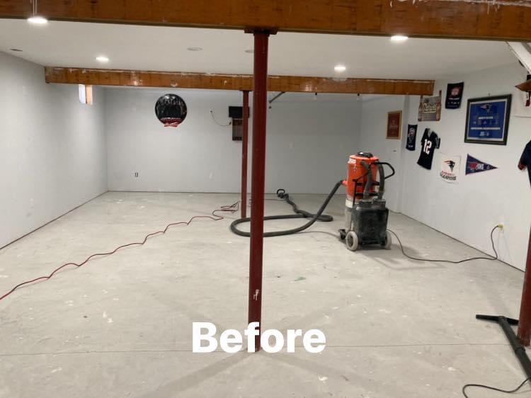
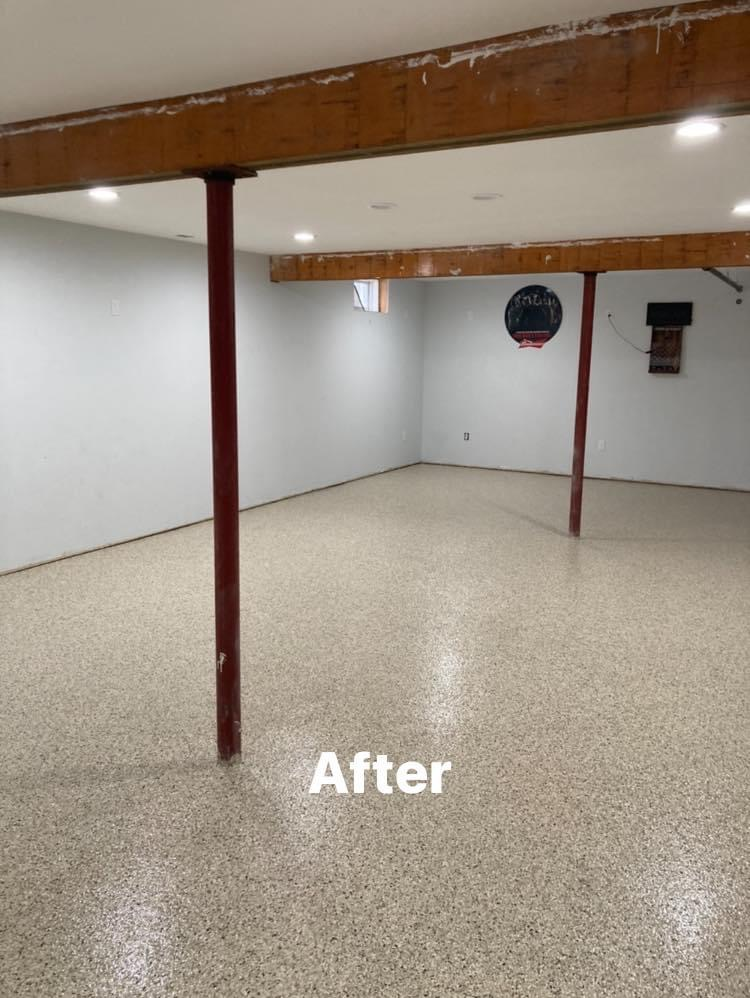
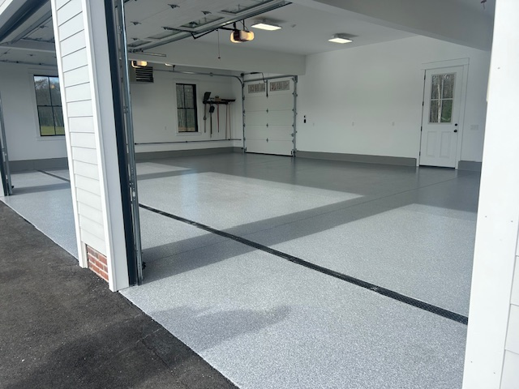
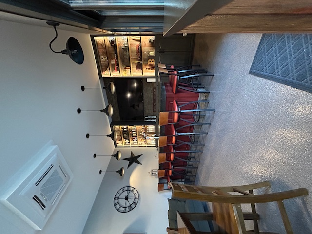

# SEO/AEO Implementation Code Snippets
## Ready-to-Use Code for index.html

---

## 📌 SECTION 1: Meta Tags to Add in `<head>`

Add these tags after the existing `<meta name="viewport">` tag (around line 5):

```html
<!-- SEO Meta Tags -->
<meta name="description" content="Premium polyaspartic concrete coatings for garage & basement floors in Western Massachusetts. 1-day installation, UV-stable, 4x more durable than epoxy. Free quote!">
<meta name="keywords" content="concrete coating, polyaspartic coating, garage floor coating, basement floor coating, Western Massachusetts, epoxy alternative, floor coating Springfield MA">
<meta name="robots" content="index, follow, max-snippet:-1, max-image-preview:large, max-video-preview:-1">
<link rel="canonical" href="https://concretecoatingspecialists.com/">

<!-- Open Graph Tags (Social Media) -->
<meta property="og:title" content="Concrete Coating Specialists | Western Massachusetts">
<meta property="og:description" content="Transform your garage & basement floors in just one day with premium polyaspartic coatings. 4x more durable than epoxy. Free quote!">
<meta property="og:image" content="https://concretecoatingspecialists.com/assets/images/hero-garage.jpg.jpg">
<meta property="og:url" content="https://concretecoatingspecialists.com/">
<meta property="og:type" content="business.business">
<meta property="og:site_name" content="Concrete Coating Specialists">

<!-- Twitter Card Tags -->
<meta name="twitter:card" content="summary_large_image">
<meta name="twitter:title" content="Concrete Coating Specialists | Western Massachusetts">
<meta name="twitter:description" content="Premium polyaspartic concrete coatings. 1-day installation. UV-stable. Free quote!">
<meta name="twitter:image" content="https://concretecoatingspecialists.com/assets/images/hero-garage.jpg.jpg">
```

---

## 📌 SECTION 2: Structured Data Schemas

Add these `<script>` tags before the closing `</body>` tag (after existing scripts):

### LocalBusiness Schema
```html
<script type="application/ld+json">
{
  "@context": "https://schema.org",
  "@type": "LocalBusiness",
  "name": "Concrete Coating Specialists",
  "image": "https://concretecoatingspecialists.com/assets/images/logo.svg",
  "description": "Premium polyaspartic concrete coatings for garage and basement floors in Western Massachusetts",
  "telephone": "(413) 668-8126",
  "email": "contact@concretecoatingspecialists.com",
  "url": "https://concretecoatingspecialists.com/",
  "address": {
    "@type": "PostalAddress",
    "addressRegion": "MA",
    "addressCountry": "US"
  },
  "areaServed": [
    {
      "@type": "City",
      "name": "Springfield"
    },
    {
      "@type": "City",
      "name": "Holyoke"
    },
    {
      "@type": "City",
      "name": "Northampton"
    },
    {
      "@type": "City",
      "name": "Palmer"
    },
    {
      "@type": "AdministrativeArea",
      "name": "Hampden County"
    },
    {
      "@type": "AdministrativeArea",
      "name": "Hampshire County"
    },
    {
      "@type": "AdministrativeArea",
      "name": "Franklin County"
    },
    {
      "@type": "AdministrativeArea",
      "name": "Berkshire County"
    }
  ],
  "priceRange": "$$"
}
</script>
```

### Organization Schema
```html
<script type="application/ld+json">
{
  "@context": "https://schema.org",
  "@type": "Organization",
  "name": "Concrete Coating Specialists",
  "url": "https://concretecoatingspecialists.com/",
  "logo": "https://concretecoatingspecialists.com/assets/images/logo.svg",
  "description": "Premium polyaspartic concrete coatings for garage and basement floors",
  "telephone": "(413) 668-8126",
  "email": "contact@concretecoatingspecialists.com",
  "address": {
    "@type": "PostalAddress",
    "addressRegion": "MA",
    "addressCountry": "US"
  }
}
</script>
```

### Service Schema (Garage Floor Coatings)
```html
<script type="application/ld+json">
{
  "@context": "https://schema.org",
  "@type": "Service",
  "name": "Garage Floor Coatings",
  "description": "Professional polyaspartic garage floor coating installation with 1-day turnaround. UV-stable, chemical resistant, 4x more durable than epoxy.",
  "provider": {
    "@type": "LocalBusiness",
    "name": "Concrete Coating Specialists",
    "telephone": "(413) 668-8126"
  },
  "areaServed": "Western Massachusetts",
  "serviceType": "Floor Coating Installation"
}
</script>
```

### Service Schema (Basement Floor Coatings)
```html
<script type="application/ld+json">
{
  "@context": "https://schema.org",
  "@type": "Service",
  "name": "Basement Floor Coatings",
  "description": "Professional polyaspartic basement floor coating installation. Waterproof, mold-resistant, creates bright finished look.",
  "provider": {
    "@type": "LocalBusiness",
    "name": "Concrete Coating Specialists",
    "telephone": "(413) 668-8126"
  },
  "areaServed": "Western Massachusetts",
  "serviceType": "Floor Coating Installation"
}
</script>
```

### FAQPage Schema
```html
<script type="application/ld+json">
{
  "@context": "https://schema.org",
  "@type": "FAQPage",
  "mainEntity": [
    {
      "@type": "Question",
      "name": "How long does installation take?",
      "acceptedAnswer": {
        "@type": "Answer",
        "text": "Most residential garage and basement projects are completed in just one day. You can walk on the surface in a few hours and drive on it within 24 hours."
      }
    },
    {
      "@type": "Question",
      "name": "Where am I going to put all of my items from the garage?",
      "acceptedAnswer": {
        "@type": "Answer",
        "text": "We provide a convenient storage solution! We'll deliver a trailer to your driveway a few days before we begin your project. You can store all of your garage items in the trailer during the coating process. This service is available for $100 per day."
      }
    },
    {
      "@type": "Question",
      "name": "How is this different from a DIY epoxy kit?",
      "acceptedAnswer": {
        "@type": "Answer",
        "text": "There is no comparison. Our system uses industrial-grade polyaspartic materials and professional diamond-grinding preparation. This ensures a bond that will not peel or fail, unlike DIY kits which often use inferior epoxy and rely on acid etching, which is a far less effective preparation method."
      }
    },
    {
      "@type": "Question",
      "name": "Is the floor slippery?",
      "acceptedAnswer": {
        "@type": "Answer",
        "text": "The vinyl flakes provide natural texture, creating a surface that is not slippery. For areas that may get wet frequently, we can include an anti-slip aggregate in the top coat for added grip, tailored to your needs."
      }
    },
    {
      "@type": "Question",
      "name": "How do I clean my new floor?",
      "acceptedAnswer": {
        "@type": "Answer",
        "text": "It's incredibly easy. The non-porous surface means spills wipe right up. For general cleaning, a simple pH-neutral cleaner and a mop or squeegee are all you need. Harsh chemicals are not necessary."
      }
    },
    {
      "@type": "Question",
      "name": "What areas do you service?",
      "acceptedAnswer": {
        "@type": "Answer",
        "text": "We proudly serve all of Western Massachusetts, including Hampden, Hampshire, Franklin, and Berkshire counties."
      }
    }
  ]
}
</script>
```

---

## 📌 SECTION 3: Improved Image Alt Text

Replace existing alt text with these more descriptive versions:

```html
<!-- Gallery Images -->






<!-- Service Images -->


```

---

## 📌 SECTION 4: Video Schema (Optional)

Add this for the YouTube video embed:

```html
<script type="application/ld+json">
{
  "@context": "https://schema.org",
  "@type": "VideoObject",
  "name": "Concrete Coating Process Video",
  "description": "See our professional concrete coating process in action",
  "thumbnailUrl": "https://img.youtube.com/vi/klyhA8fNjk8/maxresdefault.jpg",
  "uploadDate": "2024-01-01",
  "duration": "PT5M",
  "contentUrl": "https://www.youtube.com/embed/klyhA8fNjk8"
}
</script>
```

---

## ✅ IMPLEMENTATION CHECKLIST

- [ ] Add all meta tags to `<head>` section
- [ ] Add LocalBusiness schema before `</body>`
- [ ] Add Organization schema before `</body>`
- [ ] Add Service schemas (2) before `</body>`
- [ ] Add FAQPage schema before `</body>`
- [ ] Update image alt text throughout
- [ ] Add Video schema (optional)
- [ ] Test with Google Rich Results Test
- [ ] Test with Schema.org validator
- [ ] Submit to Google Search Console
- [ ] Monitor search results for rich snippets

---

## 🔗 VALIDATION TOOLS

After implementation, validate your markup:
1. **Google Rich Results Test:** https://search.google.com/test/rich-results
2. **Schema.org Validator:** https://validator.schema.org/
3. **Google Search Console:** https://search.google.com/search-console

---

## 📝 NOTES

- Replace `https://concretecoatingspecialists.com/` with your actual domain
- Update phone number and email as needed
- Add actual business address when available
- Consider adding Google Business Profile
- Monitor Google Search Console for indexing issues

